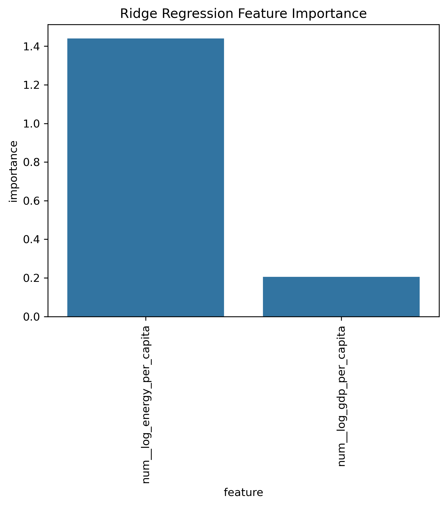
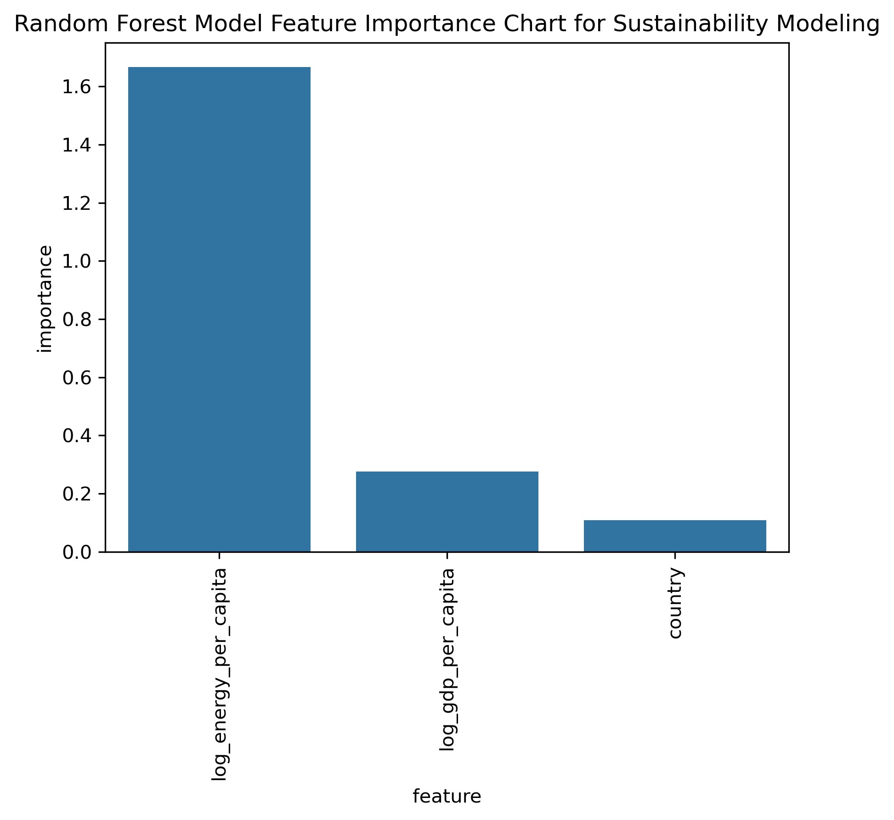
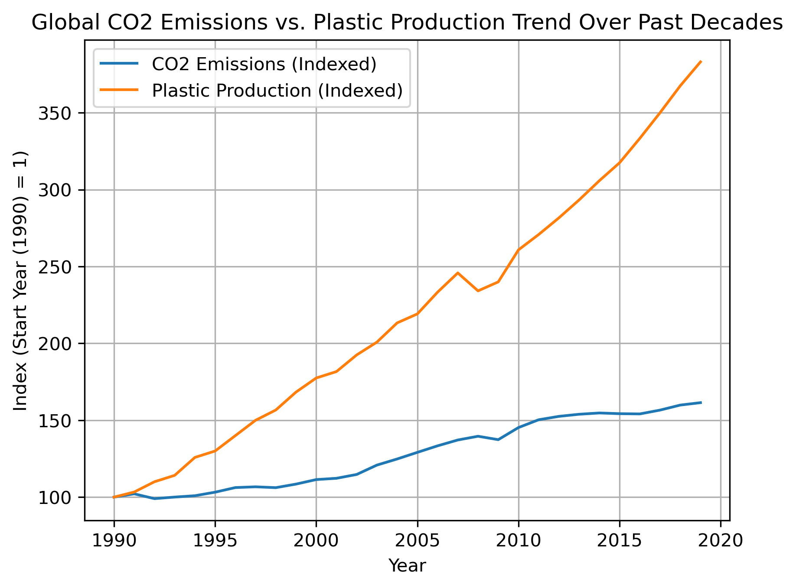

# Data Science Capstone 2 Project
## Modeling the Impact of Energy Consumption, Economic Activity & Plastic Intensive Supply Chains on Global Warming

<a target="_blank" href="https://cookiecutter-data-science.drivendata.org/">
    
</a>

## Problem Statement

How can we predict and provide actionable insights regarding the impact of national economic activity, energy usage and demographic indicators within the context of increasingly plastic intensive global supply chains over the past many decades on global warming using carbon dioxide emission levels as our key indicator?

## Goal

Generate actionable insights with the help of predictive models regarding the impact of 

1. Energy Consumption
2. Economic Activity
3. Demographic Indicators

on global CO2 emissions while also exploring the effect of plastics as a macro driver for the same.

## Models Used

Following Models were used for the analysis to model for total log co2 and log co2 per capita as target variables

1. Linear Regression
   a. Ordinary Least Squared (Unscaled + Scaled)
   b. Ridge Regression (Scaled)

2. Non Linear Model
   a. Random Forest (Scaled)

## Final Model

Ridge Regression Model was chosen to model of choice as it performed the best with the lowest RMSE, high R2 and was also interpretable.

## Results

1. Energy consumption plays a much bigger role than gdp in determining co2 emissions and hence global warming.
2. We see same results across both linear and non linear models.
3. CO2 per capita provides a better insight into the drivers of CO2 emissions compared to Total CO2 emissions.
4. Population drives Total CO2 emissions but not CO2 per capita.
5. The increasing trend of plastics production continues to contribute towards energy consumption and hence total co2 emissions and global warming.







## Key Takeaways

The main takeaway from this analysis is that in order to reduce co2 emissions and global warming, focusing on energy efficiency and cleaner energy sources is more critical compared to economic growth and population factors especially for plastic intensive supply chains globally.

## Future Improvements

1. Add country year level plastics data.
2. Add renewable energy indicators to measure their impact on global warming.

## Project Organization

```
├── LICENSE            <- Open-source license if one is chosen
├── Makefile           <- Makefile with convenience commands like `make data` or `make train`
├── README.md          <- The top-level README for developers using this project.
├── data
│   ├── external       <- Data from third party sources.
│   ├── interim        <- Intermediate data that has been transformed.
│   ├── processed      <- The final, canonical data sets for modeling.
│   └── raw            <- The original, immutable data dump.
│
├── docs               <- A default mkdocs project; see www.mkdocs.org for details
│
├── models             <- Trained and serialized models, model predictions, or model summaries
│
├── notebooks          <- Jupyter notebooks. Naming convention is a number (for ordering),
│                         the creator's initials, and a short `-` delimited description, e.g.
│                         `1.0-jqp-initial-data-exploration`.
│
├── pyproject.toml     <- Project configuration file with package metadata for 
│                         data_science_capstone_2_project and configuration for tools like black
│
├── references         <- Data dictionaries, manuals, and all other explanatory materials.
│
├── reports            <- Generated analysis as HTML, PDF, LaTeX, etc.
│   └── figures        <- Generated graphics and figures to be used in reporting
│
├── requirements.txt   <- The requirements file for reproducing the analysis environment, e.g.
│                         generated with `pip freeze > requirements.txt`
│
├── setup.cfg          <- Configuration file for flake8
│
└── data_science_capstone_2_project   <- Source code for use in this project.
    │
    ├── __init__.py             <- Makes data_science_capstone_2_project a Python module
    │
    ├── config.py               <- Store useful variables and configuration
    │
    ├── dataset.py              <- Scripts to download or generate data
    │
    ├── features.py             <- Code to create features for modeling
    │
    ├── modeling                
    │   ├── __init__.py 
    │   ├── predict.py          <- Code to run model inference with trained models          
    │   └── train.py            <- Code to train models
    │
    └── plots.py                <- Code to create visualizations
```

--------

